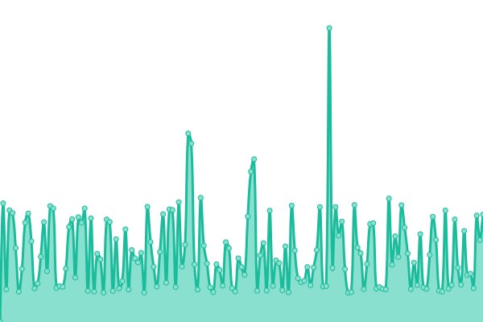

# [📈 Live Status](https://status.acomo.com.pe): <!--live status--> **🟧 Partial outage**

This repository contains the open-source uptime monitor and status page for [acomo](https://status.acomo.com.pe), powered by [Upptime](https://github.com/upptime/upptime).

With [Upptime](https://upptime.js.org), you can get your own unlimited and free uptime monitor and status page, powered entirely by a GitHub repository. We use [Issues](https://github.com/ACOMO-FINTECH/status/issues) as incident reports, [Actions](https://github.com/ACOMO-FINTECH/status/actions) as uptime monitors, and [Pages](https://status.acomo.com.pe) for the status page.

<!--start: status pages-->
<!-- This summary is generated by Upptime (https://github.com/upptime/upptime) -->
<!-- Do not edit this manually, your changes will be overwritten -->
<!-- prettier-ignore -->
| URL | Status | History | Response Time | Uptime |
| --- | ------ | ------- | ------------- | ------ |
|  ACOMO | 🟩 Up | [acomo.yml](https://github.com/ACOMO-FINTECH/status/commits/HEAD/history/acomo.yml) | 

 241ms
     
 | 

<a href="https://status.acomo.com.pe/history/acomo">100.00%</a>
    

|  ACOMO Blog | 🟥 Down | [acomo-blog.yml](https://github.com/ACOMO-FINTECH/status/commits/HEAD/history/acomo-blog.yml) | 

 0ms
     
 | 

<a href="https://status.acomo.com.pe/history/acomo-blog">0.00%</a>
    

|  ACOMO Ticket | 🟥 Down | [acomo-ticket.yml](https://github.com/ACOMO-FINTECH/status/commits/HEAD/history/acomo-ticket.yml) | 

 0ms
     
 | 

<a href="https://status.acomo.com.pe/history/acomo-ticket">0.00%</a>
    

|  ACOMO Mail | 🟥 Down | [acomo-mail.yml](https://github.com/ACOMO-FINTECH/status/commits/HEAD/history/acomo-mail.yml) | 

 0ms
     
 | 

<a href="https://status.acomo.com.pe/history/acomo-mail">0.00%</a>
    

<!--end: status pages-->

[**Visit our status website →**](https://status.acomo.com.pe)

## 📄 License

- Powered by: [Upptime](https://github.com/upptime/upptime)
- Code: [MIT](./LICENSE) © [acomo](https://status.acomo.com.pe)
- Data in the `./history` directory: [Open Database License](https://opendatacommons.org/licenses/odbl/1-0/)
